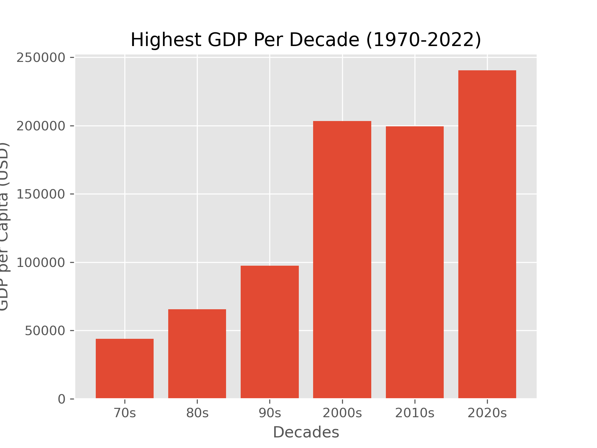
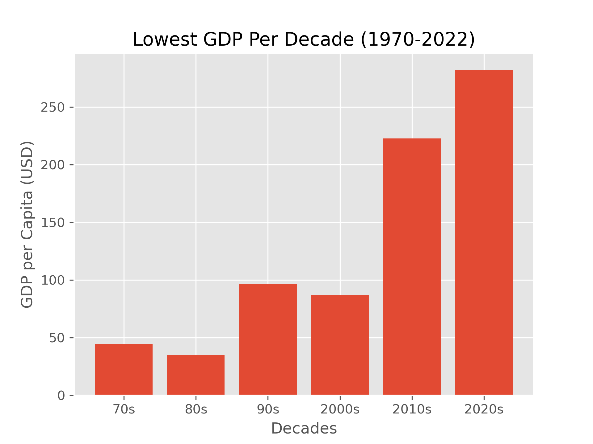

# Country_GDP_Compared

## Title- Country GDPs Compared

Main Repo Path- https://github.com/connerdekok/Country_GDP/tree/main

Contributors- 
Conner Dekok- https://github.com/connerdekok/Country_GDP/tree/feature/conner

Emily Turner- https://github.com/connerdekok/Country_GDP/tree/feature/emily
 
Dylan Phimister- https://github.com/connerdekok/Country_GDP/tree/feature/dylan

Zane Huttinga- https://github.com/connerdekok/Country_GDP/tree/feature/zane

Kossivi Agbenohevi 

## Project Summary- 
Throughout this project we looked at the statistical differences in the Per Capita GDPs of countries during the time period from 1970 to 2022.  When investigating the data we found a wide variety of interesting statistical information. All figures are in US Dollars (USD).

 	We found the highest, lowest, mean and median individual GDPs for each decade. We also found and tracked the countries with the highest and lowest GDP across all of the data. We created several different charts to help represent our data, such as a heatmap, line charts, and bar charts. We also looked at the greatest and lowest year-to-year increases and decreases, and represented that data by various bar charts. Furthermore, we separated all of the countries into the respective continents and regions to which they belong. This helped us find geographic trends in our data. 

## Questions Asked: 
What are the highest, lowest, mean and median GDP for each decade?
What are the three countries with the highest and lowest GDP across the whole time period (1970-2022)?
What are the largest and smallest year-to-year increases and decreases of all countries’ GDPs?
How does geography affect GDP (based on continent and region)?

## Project Analysis- 
The country with the highest GDP for each decade from 1970 to 2022 was Monaco. 
The countries with the lowest GDP for each decade from 1970 to 2022 were Lao People’s DR in the 70’s, Vietnam in the 80’s, Liberia in the 90’s, and Burundi from 2000 to 2022.
The mean GDP of all countries in the 70’s was $2,254.60, $4,725.73 in the 80’s, $8,371.94 in the 90’s, $13,293.19 in the 2000’s, $18,558 in the 2010’s, and $19,853.74 from 2020 to 2022.
The median GDP of all countries in the 70’s was $879.33, $1,644.96 in the 80’s, $2,275.90 in the 90’s, $3,597.59 in the 2000’s, $6,688.23 in the 2010’s, and $6,635.46 from 2020 to 2022.

The top three countries' GDP across the data set, from 1970 to 2022 were Monaco, Liechtenstein and Luxembourg respectively. The bottom three countries’ GDP were Yemen Democratic, Ethiopia and Burundi. The highest, Monaco at $101,434.51 and the lowest, Yemen Democratic at $150.48.   

Examining the overall greatest increases and decreases in GDP, we found that Monaco had the greatest overall increase in the time frame we examined from 1970 to 2022.  That greatest GDP increase was 52,595 in 2021, and Liechtenstein had the 2nd greatest increase also in 2021 with a total of 32,217.  
When viewing the greatest overall decreases, Macao had the greatest decrease in 2019 with a GDP decrease of 45,523 per capita, and Monaco had the 2nd highest decrease in 2008 with 34,996. It makes sense that the years with the greatest overall increase and decrease would occur late in the time period we examined due to there being more money in circulation as the years progress. 

When comparing continents, Europe has by far the highest median GDP. The next highest median GDP (that of North America) has been on average about 25% that of Europe since 1970. In the most recent year for which we have data (2022), North America’s median GDP is about 33% that of Europe.
However, when refining the country groupings to smaller regions within continents, certain regions are in fact comparable to or higher than regions within Europe. For instance, the median GDPs of Northern America (consisting of the US, Canada, Mexico, Greenland and Bermuda) and Australasia (consisting only of Australia in this dataset) have both been about 96% that of Western Europe on average since 1970.

Limitations of our dataset- Examining the data set we realized countries that were established in 1970 are included on this data sheet, but ones that were created later on are excluded.  As an example, the USSR (Union of Soviet Social Republics) is listed in this data set from 1970 until 1990. The USSR was dissolved in 1991, resulting in the foundation of Russia and other sovereign nations. So after 1991 there is no data given for the USSR or Russia, as neither was present for the full duration of the data set’s timeframe. 

## Charts- 

## Slides- 
[text](<Project 1 PowerPoint Slides.pdf>)

## Credit/Sources- 
Dataset: https://www.kaggle.com/datasets/dataanalyst001/per-capita-gdp-of-all-countries-1970-to-2022?resource=download

Used StackOverflow to help with creating the melted dataframe- 
	https://stackoverflow.com/questions/34830597/pandas-melt-function

Emily used tutor help to help create the Heatmap.  

